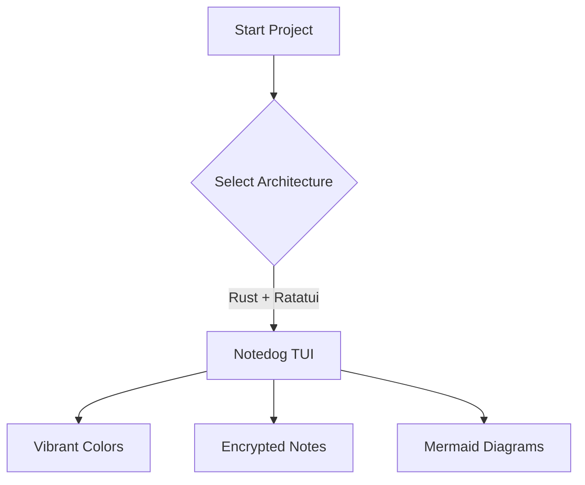

# 🐶 Notedog

> A vibrant, cross-platform TUI Notes application in Rust inspired by OneNote and Obsidian. Features universal Markdown color rendering, native Mermaid flowcharts, ChaCha20-Poly1305 + Argon2id note encryption, and custom warm themeing with background transparency.

---

## 📸 Overview

**Notedog** is built for Linux (Arch target) and cross-platform terminal enthusiasts who want an organized, keyboard-driven note-taking system. Notes are saved as plain Markdown files (`.md`) or encrypted binary notes (`.md.enc`), maintaining 100% compatibility with external Markdown editors like Obsidian, VS Code, and GitHub.

---

## ✨ Features

- **📚 OneNote-Style Hierarchy**: Organize notes into `Notebook` > `Section` (Subject/Project) > `Note.md`.
- **🎨 Universal Markdown Color Support**:
  - Uses standard HTML spans (`<span style="color:#FF8C00">text</span>`) and font tags (`<font color="gold">text</font>`).
  - Colors render directly inside the TUI **and** stay fully readable by Obsidian, VS Code, and GitHub Markdown previews.
  - Includes a quick color insertion shortcut (`Ctrl+C`) in the editor.
- **📊 Native Mermaid Flowchart Engine**:
  - Automatically parses ` ```mermaid ` code blocks (`graph TD`, `graph LR`).
  - Renders flowchart nodes with Unicode box-drawing shapes (`┌──┐`, `╭──╮`, `◇`) and directional arrows (`▼`, `──►`) directly in the terminal.
- **🔒 Secure Note Encryption**:
  - Encrypt/decrypt individual notes using **ChaCha20-Poly1305** symmetric AEAD cipher with **Argon2id** key derivation.
  - Encrypted notes are saved with `.md.enc` extension and indicated with a 🔒 lock badge in the file browser.
- **🎨 Warm Orange & Yellow Design System**:
  - Default warm amber/orange color palette (`#FF8C00`, `#F39C12`, `#FFD700`).
  - High-contrast visual distinction between **Active** (glowing bold double-border `▶ 📂 SECTIONS ◀`) and **Inactive** (subtle dark charcoal border) panes.
  - Supports transparent terminal background (`transparent_background = true`).
  - Fully customizable via `~/.config/notedog/notedog.toml`.
- **✏️ Flexible Editing Options**:
  - Built-in TUI text editor with live syntax colors, line numbers, cursor highlighting, and shortcut toolbars.
  - Launch external editors (`$EDITOR`, `nvim`, `nano`, `micro`) with `x` key, auto-reloading upon exit.

---

## ⌨️ Keybindings

| Keybinding | Action |
| :--- | :--- |
| `Tab` / `Shift+Tab` | Cycle focus between **Notebooks**, **Sections**, **Notes**, and **Main View** |
| `←` / `→` or `h` / `l` | Switch active **Notebook** tab (when Notebooks pane focused) |
| `F1` | Cycle active **Notebook** tab |
| `↑` / `↓` / `k` / `j` | Navigate list items or scroll note preview |
| `PageUp` / `PageDown` | Fast scroll note preview |
| `f` / `F11` / `Ctrl+F` | **Toggle Fullscreen Mode** for Editor or Viewer |
| `w` | **Toggle Word Wrap ON/OFF** in Note Viewer |
| `e` / `Enter` | Open built-in TUI text editor (or unlock encrypted note) |
| `x` | Launch external editor (`$EDITOR` / `nvim` / `nano`) |
| `Ctrl+S` | Save current note (in built-in editor) |
| `Ctrl+C` | Insert HTML Color tag (`<span style="color:#FF8C00">`) |
| `Ctrl+M` | Insert Mermaid flowchart template |
| `Ctrl+N` | **Contextual Create**: Create Notebook, Section, or Note depending on focused pane (uses configurable default title template if empty) |
| `Ctrl+B` | Create a new **Notebook** |
| `Ctrl+K` | Create a new **Section** |
| `r` / `Ctrl+R` | **Contextual Rename**: Rename focused Notebook, Section, or Note on disk |
| `Ctrl+D` / `d` | **Contextual Delete**: Safely delete focused Notebook, Section, or Note with confirmation dialog |
| `v` / `Ctrl+V` | **Revision History Modal**: Browse endless file version snapshots, view live line diffs (`+`/`-`), restore past revisions, or open cleanup presets |
| `Ctrl+E` | Encrypt or Decrypt current note (prompts for passphrase) |
| `F2` / `Ctrl+A` | Open **About NoteDog** page (Author: **Bolt J Woofson**, Repository: `Woofson/notedog`) |
| `?` | Toggle interactive Help & Shortcut cheat sheet modal |
| `q` | Quit Notedog |

---

---

## 🚀 CLI Usage & System Initialization

```bash
# Run Notedog normally
notedog

# Verify/initialize clean starter notes (SAFEGUARD: Preserves existing notes!)
notedog --clean

# Print CLI help and storage paths
notedog --help

# Print version and author information
notedog --version
```

---

## ⚙️ Configuration & Storage Layout

### Storage Architecture
By default, Notedog stores all notebooks and notes in `~/Notes` (configurable via `note_folder`):

```text
~/Notes/
├── 📚 Personal/
│   ├── 📌 General/
│   │   ├── 01_Welcome.md
│   │   └── 02_Mermaid_Flowcharts.md
│   └── 🔒 Secrets/
│       └── 03_Secrets.md.enc
└── .notedog_versions/              # Hidden endless revision history store
```

### Config Files
Notedog automatically creates example configuration files on first launch:
- `~/.config/notedog/notedog.toml` (Active Configuration)
- `~/.config/notedog/notedog.toml.example` (Full Example Config with inline comments)
- `~/.config/notedog/theme.toml.example` (4 Curated Warm & Dark Color Palettes)

```toml
# Notedog Configuration File (~/.config/notedog/notedog.toml)

note_folder = "~/Notes"
editor = "builtin"             # "builtin", "nvim", "nano", "micro"
secrets_file = "~/.config/notedog/secrets.toml"
transparent_background = true
show_help_bar = true
word_wrap = true
default_notebook = "Personal"

[theme]
primary = "#FF8C00"            # Dark Orange
secondary = "#F39C12"          # Amber / Gold
accent = "#FFD700"             # Gold
foreground = "#FDFEFE"         # Warm Off-White
background = "#1C1B1A"         # Deep Charcoal
border = "#504A45"             # Warm Charcoal
encrypted_tag = "#E74C3C"      # Coral Red
```

---

## 🎨 Color Markdown Syntax Examples

Notedog parses the following color formats in Markdown text:

```markdown
<!-- Standard HTML Span (Obsidian, VS Code, GitHub compatible) -->
<span style="color:#FF8C00">Warm Orange Text</span>

<!-- HTML Font Tag -->
<font color="#FFA500">Bright Amber Text</font>

<!-- Notedog Shorthand -->
{[#FFD700]Gold Accent Text}
```

---

## 📊 Mermaid Diagram Example

Write standard Mermaid blocks inside your notes:



Notedog renders this as:

```text
 📊 [Flowchart: Top-Down] 

   ┌─────────────┐
   │Start Project│
   └─────────────┘
   │ 
   ▼ 
   ┌─────────────┐
   │Select Archi…│
   └─────────────┘
   │ [Rust + Ratatui] 
   ▼ 
   ┌─────────────┐
   │ Notedog TUI │
   └─────────────┘
```

---

## 📦 Building & Running

### Prerequisites
- Rust 1.70+ (`cargo`, `rustc`)

### Build & Run
```bash
# Clone repository
git clone https://github.com/yourusername/notedog.git
cd notedog

# Run in debug mode
cargo run

# Build optimized release binary
cargo build --release
./target/release/notedog

# Run unit tests
cargo test
```

---

## 📄 License

MIT License. Built with ❤️ for terminal productivity.
